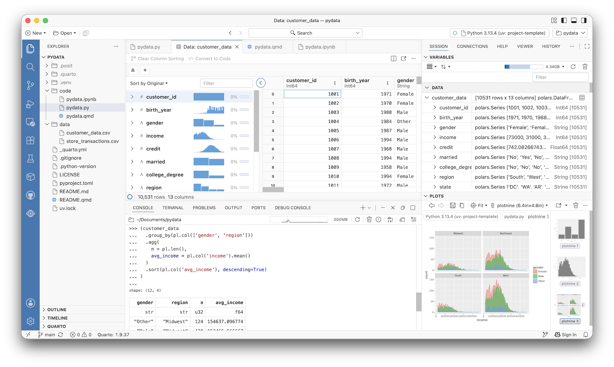
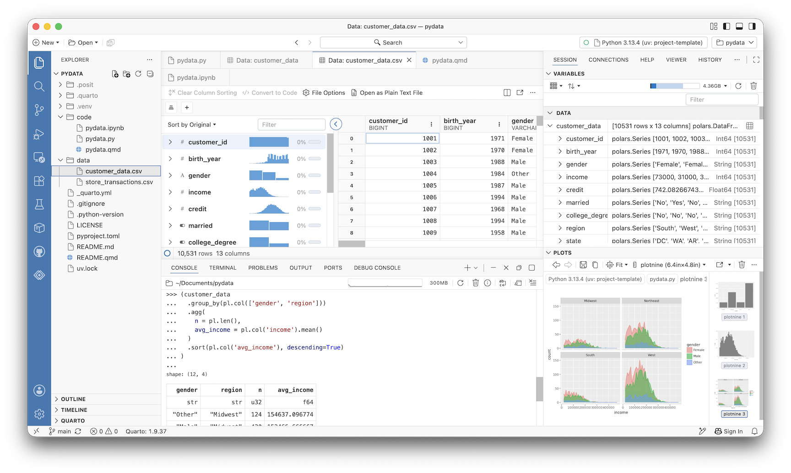
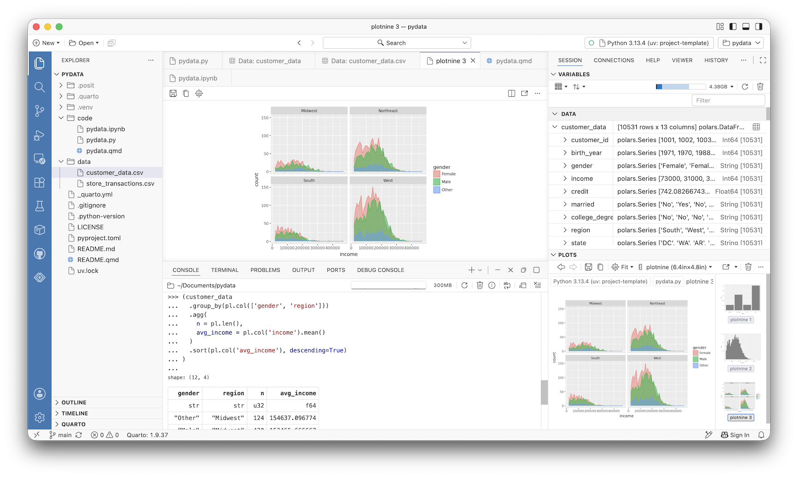
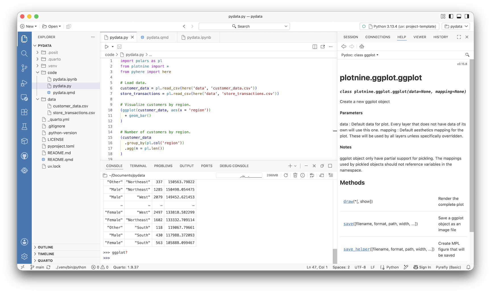
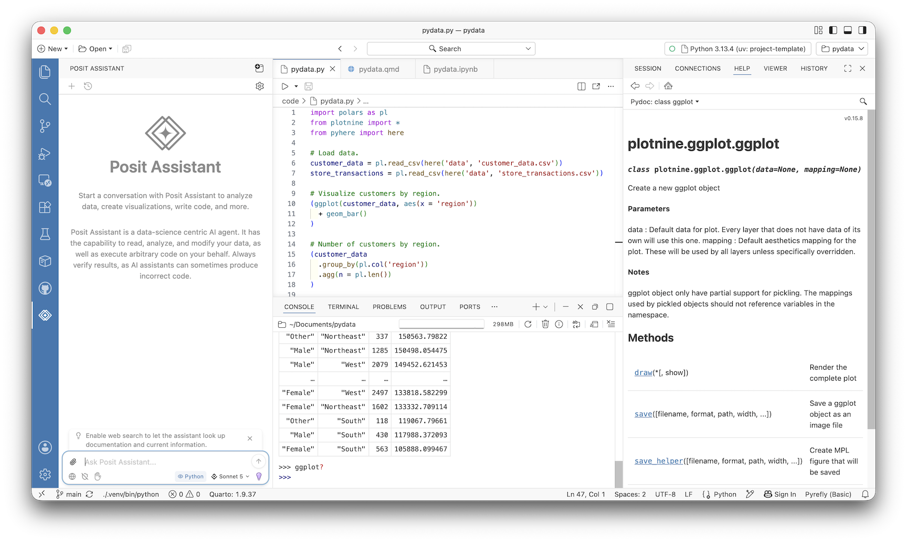
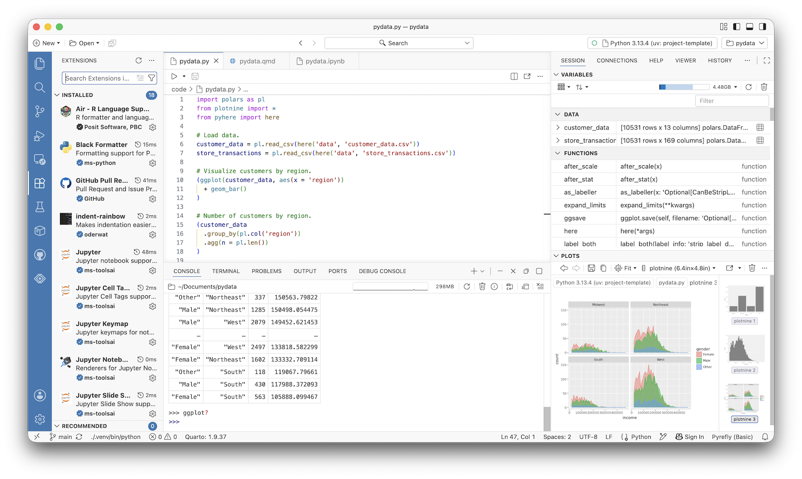
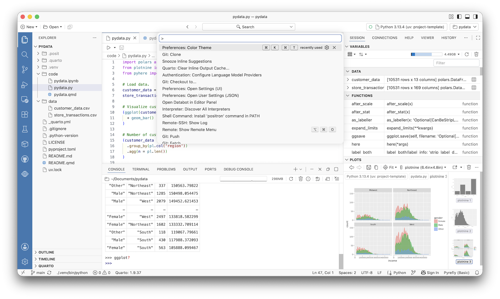
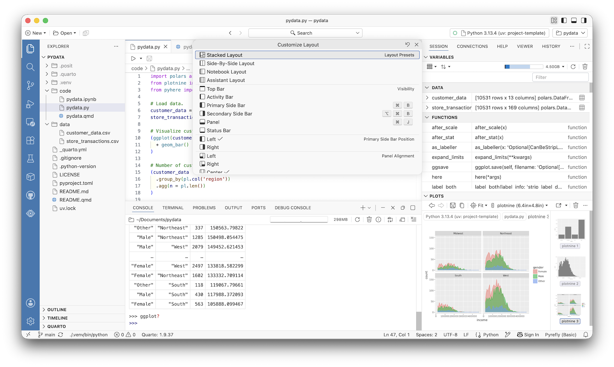
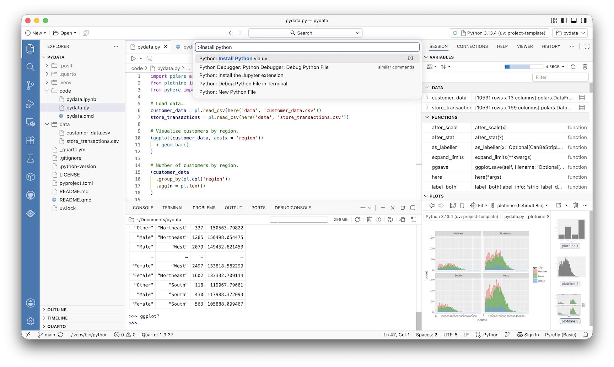

# Data Stack

This repository provides training for setting up and using the following
data stack, a collection of tools for working on data analytics
projects. The intended audience is students in my courses at the [Jon M.
Huntsman School of Business](https://huntsman.usu.edu) at [Utah State
University](https://www.usu.edu), students that I’m mentoring on
projects at the [Analytics Solutions
Center](https://huntsman.usu.edu/asc/) (ASC), and collaborators on
research projects.

The data stack consists of the following:

- [Positron](#sec-positron) as the code editor or integrated development
  environment
- [Python](#sec-python) for data wrangling, visualizations, and modeling
- [Quarto](#sec-quarto) for communicating results with presentations,
  reports, dashboards, etc.
- [GitHub](#sec-github) for version control, project management, and
  collaboration

Every modern data stack includes AI tools. All Utah State students have
[access to a specific set](https://www.usu.edu/ai/tools). While AI can
help learning and productivity (e.g., drafting and debugging code), it
can also be harmful. AI is dangerous when we use it to replace rather
than supplement thinking and decision-making, especially when we don’t
know enough about a topic to evaluate what the AI generates. If you use
AI tools, be thoughtful and transparent, including reviewing what the AI
generates and citing the AI tool you use.

## Positron

A **code editor** or **integrated development environment (IDE)** is
arguably your most important tool. A good IDE provides a single tool for
writing and running code, including communicating results and
implementing version control. There are many options, but I use
[Positron](https://positron.posit.co), a next-generation data science
IDE. Built on VS Code’s [open source
core](https://github.com/microsoft/vscode), Positron combines the
multilingual extensibility of [VS Code](https://code.visualstudio.com/)
with essential data tools common to language-specific IDEs.

Get started by [downloading](https://positron.posit.co/download.html)
and installing Positron and walking through the following highlights of
some of Positron’s essential features, especially its data-friendly
functionality.

### Console and Session

If you’ve used VS Code, Positron’s layout will look familiar. When
selected from the vertical activity bar, the explorer on the left shows
the folder you have open, which also establishes your **working
directory** (i.e., the location on your machine for your project files).
The editor in the center is where you code. Two obvious differences are
the console (in the bottom panel by default) and the session (on the
right by default).

The console is where code runs (use Cmd/Ctrl + Enter to run the
currently selected code in the editor) and is separate from the
**terminal** (also called the command line or shell, in the bottom panel
by default). The terminal is used to interact with your operating system
to do things outside running code, like installing Python libraries.
There is no console in VS Code and so code also runs in the terminal,
which often means you have multiple terminals running for different
purposes. The session displays the variables (e.g., data, functions, and
methods) you’ve loaded and plots you’ve created.

### Data Explorer

You can click on the data frame icon to the right of any data you’ve
loaded in the session to open the data explorer. The data explorer
provides a summary of the data, including simple visualizations, and
allows you to quickly sort and filter the data to inform data wrangling.

The data explorer is designed to facilitate coding, not replace it. If
you want to implement any of the sorting, filtering, etc. you make using
the data explorer in code, click the **convert to code** button in to
the action bar at the top.

You can also click on Excel, comma-separated value (CSV), Parquet, PDF,
and other files in your working directory to view them without needing
to load them or use another program.

### Plots

Along with variables, the session has a dedicated pane for
visualizations, including a history gallery to click through and easily
compare previous plots. Visualizations can also be opened as a separate
tab in the editor pane. This includes support for interactive plots.

### Help

Including a question mark after most any function, method, or attribute
in the console will open the help (on the right by default). The help
serves as a built-in web browser to allow you to reference online
documentation, including parameter definitions and examples you can copy
and use.

### Posit Assistant

Posit Assistant, selected from the vertical activity bar, is an AI tool
integrated in Positron with contextual awareness of everything in your
working directory. You can use Posit Assistant to ask questions, edit
code, and function as an agent to accomplish specific tasks. It can use
a variety of providers to interact with your data and code.

### Extensions

VS Code, and thus Positron, is highly extensible. Installed extensions
are visible when selected from the vertical activity bar, along with the
ability to search additional available extensions.

Since Positron is open source, there are certain proprietary VS Code
extensions that aren’t available in Positron. The search functionality
references the [Open VSX Registry](https://open-vsx.org) for all
available extensions.

### Command Palette

The **command palette** is the primary way to manage options (e.g.,
customize layout and themes) and is a mainstay of the shortcut-heavy VS
Code. Open with Cmd/Ctrl + Shift + P.

### Customize Layout

In the upper-right corner are a set of icons to customize the layout of
Positron, including a number of layout presets and toggles for side bars
and panels.

There is more that [Positron](https://positron.posit.co/welcome.html)
can do, including [connecting to
databases](https://positron.posit.co/connections-pane.html) and
[remoting into virtual
machines](https://positron.posit.co/remote-ssh.html). Additionally,
since Positron is built on VS Code’s open source core, VS Code’s
excellent [documentation](https://code.visualstudio.com/docs) remains
largely relevant.

## Python

<!-- - Ruff code linter is also included -- need to enable? -->

Python is a general purpose, **open source programming language**, often
referred to as “the second-best language for everything.” Notably,
Python comes pre-installed on some operating systems (OS). This version
*should not be used or modifed* by anyone except the OS itself. For this
and other reasons, you’ll need the ability to install and maintain
multiple versions of Python on the same computer.

There are many ways to install and maintain Python versions. However,
[uv](https://docs.astral.sh/uv/) has emerged as the industry standard.
Get started by opening the command palette in Positron (Cmd/Ctrl +
Shift + P) and running “Install Python via uv.”

This command installs uv and the latest version of Python for you via
the terminal. Note that the needed extension to run Python in Positron
comes pre-installed. The following highlights of some of Python’s
essential features for data analysis.

### Functions and Methods

Most of the coding we do for data analysis uses **functions**, where the
input is some data and the output is some transformation, visualization,
or model results. However, Python is an **object-oriented programming
language**, meaning there is a difference between functions and
**methods**, a kind of function that only works for specific objects.

Python functions are typically **namespaced**, meaning the name of the
library they’re from is referenced with the function, as in
`library.function()`. Functions can also be namespaced with the
**alias** of the library that was set when the library was imported. For
example, using the Polars alias `pl` in
`pl.read_csv('customer_data.csv')` to read in `customer_data.csv`.
Methods are functions nested within **object types** and are namespaced
with an object name of the given type as in `object.method()`. For
example, using the Polars select method in
`customer_data.select(pl.col('income'))` to select the `income` column
in the `customer_data` dataframe object.

Besides functions and methods, **attributes** are object-specific
features and are, like methods, namespaced with an object name of the
given type as in `object.attribute`, but without any parentheses. For
example, the column names of the `customer_data` dataframe object can be
referenced with `customer_data.columns`.

### Libraries

Python is a big tent, meaning it is used for many applications and not
just data analytics. As an open source programming language, there are a
lot of different **libraries** or **packages** that have been developed
by users to facilitate coding for different applications. Each library
or package is a set of functions, methods, documentation, and sometimes
data. While there are many Python libraries, I recommend the following
for the three data analytics tasks.

- **Data Wrangling**: [Polars](https://pola.rs/) is a fast,
  self-consistent library for data wrangling (i.e., cleaning and
  manipulating data) that is growing in popularity as an alternative to
  [pandas](https://pandas.pydata.org). Additionally, when you read in
  data to wrangle, be sure to write **relative file paths** using
  [pyhere](https://pypi.org/project/pyhere/).
- **Visualizations**: [Plotnine](https://plotnine.org) is a library
  built using the consistency of the grammar of graphics philosophy for
  visualizations. It is a port of R’s {ggplot2} package, which is the
  industry standard across open source programming languages.
- **Modeling**: [scikit-learn](https://scikit-learn.org/stable/) is the
  most widely used library for machine learning, but it doesn’t do
  statistical inference. For statistical inference, the
  [statsmodels](https://www.statsmodels.org/) and
  [Bambi](https://bambinos.github.io/bambi/) libraries are used for
  frequentist and Bayesian modeling, respectively.

There are many ways to install and maintain libraries, but uv installs
and manages both Python versions and libraries. For example, to install
Polars, in the terminal run `uv add polars`.

The terminal (i.e., the command line or shell) is the programming
interface into your OS itself. Note that the name of the terminal will
be different based on your OS. The macOS terminal is **Zsh**, the Linux
terminal is **Bash**, and the Windows terminal is **PowerShell**. You
can think of the console as a specialized terminal for running code only
while the general terminal is where we can interact with the operating
system for everything outside of running code. This includes uv and
Python, which Positron handled for us with the “Install Python via uv”
command, and now installing Python libraries.

Just like you only need to install Positron, uv, and Python once, you
only need to install Python libraries once. You can see what libraries
or packages you have installed by selecting packages from the vertical
activity bar.

This list includes libraries you’ve installed, the libraries that come
pre-installed with Python, and any **dependencies** or the libraries
that those libraries depend on. You can also see which libraries have
newer versions you can update to.

### Project Environments

In order for our code to be **reproducible**, we need to maintain
**project environments**. A project environment is composed of both
Python and the libraries (including the dependencies) used for a given
project. What makes a project environment reproducible is keeping track
of the Python and library versions we’re using for a given project so
that it can be easily reproduced on another machine by you (including
future you) or someone else. You can set up your own project environment
or use an existing one, like the one included when you use my [project
template](https://github.com/marcdotson/project-template). If you aren’t
using my project template, it’s still easy to set up and manage a
project environment with uv.

1.  Open the project working directory in Positron. Note that this
    working directory *should not* be in a location on your local
    machine that is being synced to the cloud via OneDrive, iCloud, etc.
2.  Run `uv init` in the terminal to initialize a project environment.
    This creates a `pyproject.toml` file with metadata about the project
    and a hidden `.python-version` file that specifies the default
    version of Python for the project. (It also creates `main.py` and
    `README.md` files that you can use or delete.)
3.  With the project environment initialized, you can install libraries.
    For example, running `uv add polars` via the terminal installs
    Polars (and any dependencies) and creates both a `uv.lock` file that
    keeps track of the versions of the libraries you’ve installed and a
    hidden `/.venv` reproducible (or *virtual*, hence the “v” in venv)
    environment folder that serves as the **project library**.

All Python libraries are installed in a single, global library on your
computer known as the **system library**. The fact that we have a
*project library* highlights an important feature of making project
environments reproducible: Each project will have its own project
library and thus be isolated. If two projects use different versions of
the same package, they won’t conflict with each other because they’ll
each have their own project library. (Well, not exactly. Python employs
a global cache to avoid having to install the same version of a given
library more than once. The project library will reference the global
cache.) Whenever you install new libraries for your project, the
`uv.lock` file is automatically updated.

If you are using an existing project environment maintained by uv,
including ones based on my [project
template](https://github.com/marcdotson/project-template), you simply
need to open the project working directory in Positron and run `uv run`
in the terminal. This will install the correct `.python-version` if you
don’t have it, create the hidden `/.venv` project library, and install
the correct versions of the needed libraries as specified in the
`uv.lock` file.

There is a *lot* more that [uv](https://docs.astral.sh/uv/) can do. You
can manually install specific versions of Python, such as
`uv python install 3.13.4` to install Python 3.13.4, and view Python
versions that are available to install with `uv python list`. If someone
is using another tool to install libraries instead of uv (e.g., pip),
they will likely need a `requirements.txt` file or a `pylock.toml` file
to reproduce the project environment, which you can generate for them
with `uv export --format requirements.txt` or
`uv export -o pylock.toml`, respectively.

### Efficiency vs. Readability

Just like different application use different Python libraries, so do
different applications lend themselves to different coding styles. For
example, the code that runs the transaction backend for the payment
system of an online application needs to be incredibly **efficient** and
secure since its managing sensitive information and being at a high
frequency. On the other hand, the code for a data analysis with
moderate-sized data, even if the resulting report is reproduced often,
runs very infrequently so efficiency takes a back seat to the code being
**readable**.

Code used in production must be efficient, but often at the cost of it
being readable – especially when custom functions are created. Code use
in data analysis needs to be readable, often because it doesn’t need to
be incredibly efficient. This is important if you are coding with the
help of an AI tool, which will naturally gravitate toward needless
efficiency and an overabundance of code I refer to as **AI bloat**. As
you code for data analysis, focus on readability. You’ll be more
productive when working with AI tools since you should be able to better
understand the output.

Perhaps the most readable code is produced with a technique called
**method chaining**. Instead of saving out intermediate objects for
every step in a set of method calls, just chain them all together.

The resulting code, which has to be enclosed in parentheses, can be read
like a sentence as we move from one method to the next. Using Cmd/Ctrl +
Enter to run the currently selected code in the editor will run an
entire method chain. Method chaining is enabled by Polars syntax and is
mirrored in the composition of Plotnine’s grammar of graphics.

> [!TIP]
>
> ### R and Julia
>
> Python might be the most commonly used open source programming
> language for data wrangling, visualizations, and modeling – but it’s
> not the only one. The three most popular languages for data analytics
> are Julia, Python, and R (the **Jupyter** kernel was named for and
> designed to support all three). Each language comes with its own
> tradeoffs, culture, and overall vibe.
>
> - Julia is the newest and fastest and was developed by mathematicians.
> - Python is the most popular and diverse in terms of libraries and
>   applications and was developed by computer scientists.
> - R is the most narrowly focused on data analytics and culturally
>   cohesive and was developed by statisticians.
>
> If you want to learn more than one of the three languages, and you
> arguably should, I recommend focusing on becoming proficient in one
> language first and then transferring that understanding to picking up
> a second. For example, see [how I learned Python coming from a
> background using
> R](https://occasionaldivergences.com/posts/python-intro/).

## Quarto

<!-- - Inline support turn on `positron.quarto.inlineOutput.enabled` or is it default? -->

Much of the code we write for a project can use flat text Python `.py`
scripts. However, if we need to produce an output in a format other than
code, for example a report, then we should use something else.
[Quarto](https://quarto.org) is an **open source publishing system**
where we can combine writing along with code and its output. If you’ve
used Jupyter notebooks, Quarto documents will be familiar with
designated sections for writing and code.

Like in Jupyter notebooks, we can run each of the code blocks
individually or all at once with the *play* buttons. Unlike Jupyter
notebooks, the code blocks in Quarto documents are flat text Python
scripts so we can still use Cmd/Ctrl + Enter to run individual lines of
code within a code block.

The most important difference is that the notebook format of a Quarto
document is simply a means to an end. Quarto can take whatever we
produce within the document and render it into a Word document,
PowerPoint presentation, PDF, Revealjs slide deck, interactive
dashboard, website, etc. Browse through the
[gallery](https://quarto.org/docs/gallery/) to see what sort of things
are possible.

The Quarto extension comes pre-installed with Positron. The [project
template](https://github.com/marcdotson/project-template) has Quarto
documents (e.g., `README.qmd`) used throughout. Whenever you make a
change to a Quarto document, render the document (click on Preview or
Cmd/Ctrl + Shift + K) into its specified format and a preview of the
rendered document will appear in Positron’s viewer (in the right pane by
default).

If you are using Python within the Quarto document, Quarto will render
the output using the Jupyter kernel in the background. In fact, as
needed, a Quarto document can be used in conjunction with a [Jupyter
notebook](https://quarto.org/docs/get-started/hello/jupyter.html) to
render into all of these different outputs. For example, we can render a
Jupyter notebook called `data-analysis.ipynb` into a PDF using the
command line with `quarto render data-analysis.ipynb --to typst`.

The [Quarto documentation](https://quarto.org/docs/guide/) is
comprehensive and highly recommended, especially as you adapt work for
different formats. The following sections highlight some of the
essential features of Quarto documents.

### YAML

The header at the top of any Quarto document is coded in *YAML* (i.e.,
Yet Another Markup Language), which follows a simple `key: value`
syntax. For most Quarto documents in a project repository, you should
set `format: gfm`. When you render your Quarto document, it will create
a separate markdown document using “GitHub Flavored Markdown” that
GitHub can parse. For example, the header for this document is:

    ---
    title: "Data Stack"
    format: gfm
    ---

If you want to render the document into a PDF, use `format: typst`
instead. [Typst](https://quarto.org/docs/output-formats/typst.html) is
modern, fast typesetting software for creating PDFs. Typst comes
pre-installed with Quarto. The alternative is to [install and
use](https://quarto.org/docs/output-formats/pdf-basics.html) a slower
and more cumbersome typesetting distribution tied to `format: pdf`.

### Markdown

Quarto documents use
[markdown](https://quarto.org/docs/authoring/markdown-basics.html), just
like in Jupyter notebooks. Markdown is a simple, generic typesetting
syntax. Note that GitHub recognizes this syntax, including in issues and
pull requests.

Sometimes working with markdown alone can be challenging. Positron
includes a visual mode you can access inside any Quarto document. The
visual mode includes some point-and-click options to help you produce
markdown syntax, which can be especially helpful for things like
[tables](https://quarto.org/docs/authoring/tables.html) and
[citations](https://quarto.org/docs/authoring/citations.html).

### Code

Quarto allows us to include [code
blocks](https://quarto.org/docs/computations/python.html) and output as
part of the document. Much like Jupyter notebooks, you can include
Julia, Python, and R code as well as C++, Stan, and other code blocks
and output. To run Python code only, specify `jupyter: python3` in the
header YAML.

> [!NOTE]
>
> ### Quarto Projects
>
> One quirk of using Quarto is that when you run code in the code blocks
> vs. render the Quarto document into its specified format, the working
> directory will be *different*. By default, the folder you have open in
> the explorer is identified as the working directory for the code you
> run in the code blocks. However, when you render the Quarto document
> into its output, Quarto will think that the directory the Quarto
> document is in is the working directory.
>
> This is especially a problem when you’re reading or writing data,
> figures, etc. This is where [Quarto
> projects](https://quarto.org/docs/projects/quarto-projects.html) come
> in. At its simplest, a Quarto project allows you to share YAML
> configurations across all the Quarto documents in a given project.
> This is accomplished with a Quarto project configuration file in the
> working directory called `_quarto.yml`. To make the working
> directories consistent, the `_quarto.yml` file includes:
>
>     project:
>       execute-dir: project
>
> This is applied to every Quarto document you render in the project,
> and it’s already included in the [project
> template](https://github.com/marcdotson/project-template).

There are a variety of options for each code block. In addition to
specifying the language used within the code block, the code block can
be given an identifier, can have warnings suppressed, can run without
producing output, etc. These options are specified using YAML syntax
following the hashpipe operator `#|` within the body of the code block.
Any code block YAML that should apply to the document in its entirety
can simply be moved into the header YAML.

### Equations

If you need to include any math, you shouldn’t be surprised that there’s
a typesetting syntax for that. It’s tied to
[LaTeX](https://www.latex-project.org) (pronounced “lah-tech” or
“lay-tech”) and our primary interest is using it’s [math
syntax](https://oeis.org/wiki/List_of_LaTeX_mathematical_symbols). Use
`$` around any in-line LaTeX notation or `$$` around equations specified
as a separate line. For example, we can reference
$p(\theta | X) \propto p(X | \theta) \ p(\theta)$ in-line as well as
centered on its own:

$$p(\theta | X) \propto p(X | \theta) \ p(\theta)$$

## GitHub

<!-- - Update with screenshots from Positron
- Revise project template reports, **/*.quarto_ipynb_*? -->

Git is a powerful [version control
system](https://peerj.com/preprints/3159v2/). While it is the industry
standard for software development, we can easily adopt this framework to
provide structure for any kind of data project. GitHub is an online
hosting service where each project lives in its own repository. Learning
to use Git and GitHub not only aids in collaboration, it will ultimately
allow you to develop an online portfolio of work.

To get started, you’ll need to [register a GitHub
account](https://happygitwithr.com/github-acct#github-acct) and install
Git [using the command
line](https://happygitwithr.com/install-git#install-git) (substituting R
references with Python and RStudio with Positron) or [downloading the
latest source](https://git-scm.com/downloads). You’ll also need to both
[introduce yourself to Git](https://happygitwithr.com/hello-git) (using
the email associated with your GitHub account and again substituting R
references with Python and RStudio with Positron) and then authorize
Positron to use your GitHub credentials (which you *should* be prompted
to do when first cloning your project repository). Note that when you
get a prompt from Positron to use `Git: Fetch` automatically, go ahead
and select yes. This will allow your local Git to be aware of updates,
including new branches, on GitHub.

I recommend using my [project
template](https://github.com/marcdotson/project-template) to create your
project repository. Just click on “Use this template” and create a new
repository with a short, lowercase, hyphenated slug as the repository
name that’s consistent with the project (e.g., advanced-coursework). One
person will maintain the repository and have it connected to their
account (i.e., the mentor for ASC projects) while others working on the
project can be added as collaborators. Anyone with access to the project
repository can copy (i.e., *fork*) it to save, maintain, or contribute
to if they aren’t a collaborator.

Note that there are certain limitations to the size and type of files
that can be hosted (i.e., *pushed* to GitHub). There are also certain
things that shouldn’t be accessible by the public (e.g., data we are
under NDA to access). For these reasons, we have files and folders that
are pushed to GitHub and those that are not. Here’s how the project
repository is organized:

- `/code` Scripts with prefixes (e.g., `01_import-data.py`,
  `02_clean-data.py`) and functions in `/code/src`.
- `/data` Simulated and real data, the latter not pushed.
- `/figures` PNG images and plots.
- `/output` Output from model runs, not pushed.
- `/presentations` Presentation slides.
- `/private` A catch-all folder for miscellaneous files, not pushed.
- `/writing` Paper, report, and case studies.
- `/.quarto` Hidden Quarto project library, not pushed.
- `/.venv` Hidden Python project library, not pushed.
- `.gitignore` Hidden Git instructions file.
- `.python-version` Hidden Python version file.
- `LICENSE` MIT License for “as is” permission.
- `README.md` GitHub-flavored markdown README rendered from
  `README.qmd`.
- `README.qmd` Quarto markdown README to edit and render into
  `README.md`.
- `_quarto.yml` Quarto project configuration file.
- `pyproject.toml` Python project environment configuration file.
- `uv.lock` Python project environment lockfile.

Any file or folder that begins with a period is hidden (i.e., you won’t
see it in your OS file explorer by default, but you will see it in the
explorer in Positron). The `.gitignore` file is what controls which
files and folders are pushed. Note that the [project
template](https://github.com/marcdotson/project-template) also includes
instructions for using the project environment and has a link to this
training.

### Issues

To stay organized, manage your project by keeping track of tasks using
GitHub’s issues (see the tab at the top of the project repository on
GitHub). There you can have an ongoing conversation and close tasks out
when a given issue is completed or resolved. Be sure to tag
collaborators you want to see a specific comment (e.g., `@marcdotson`).
Think of this as an email thread or chat channel except all of the
conversations are in one place, easily searchable, and automatically
archived as part of the version control.

### Clone

Once you are a collaborator on a project repository, you can *clone* it.
Cloning simply means you’re creating a local copy of the repository,
though the clone isn’t just a copy of the folder. Git still works in the
background keeping track of changes and managing the version control.
Using the command palatte in Positron, use the `Git:Clone` command and
select the project repository you’d like to clone.

You only need to clone the project repository one time. Please note that
any of the files and folders that aren’t pushed to GitHub can be created
in your cloned repository without any impact on the repository hosted on
GitHub. For example, I typically store PDFs and other related materials
that I don’t want to (or can’t) share in the `/private` folder so that
the resources I need are all within the same directory on my computer.

### Branches

Remember that Git and GitHub are built for software development.
Following that analogy, Git operates through the use of
[*branches*](https://code.visualstudio.com/docs/sourcecontrol/intro-to-git#_using-branches).
Each branch in a repository is a separate version of the repository that
exists in parallel and is focused on a specific issue. For example, we
could have a branch called `initial-model` and another branch called
`data-cleaning`. For version control to be useful, we need to be concise
and descriptive with branch and other naming conventions (i.e., no
`final-final-draft-02` nonsense here).

Every repository has a `main` branch. If this were software, the `main`
branch would be the branch that is being used in production. *Never make
changes directly to the `main` branch.* You can see which branch you’re
working in by looking at the bottom left corner in Positron. Assuming
the branch you need to work on has already been created, the first thing
you should do when starting to work is navigate to the branch you want
to work in. Use `Git: Checkout to...` via the command palette to select
the correct branch.

### Commit, Push, and Pull

You’ve identified what you need to work on using issues, cloned the
project repository, and made sure you’re working on the correct branch.
Finally, you can get to work! Then what? Once you’ve made a number of
changes to your cloned project respository, how do you share that with
your collaborators? If you click on the source control tab below the
explorer (by default in the left pane in Positron) you’ll see all of the
files you’ve changed. You first need to *stage* these changes using the
plus sign next to the files. You then need to provide a *commit
message*. Like the branch names, these should be short and descriptive,
like “Created a function to parse text data” or “Cleaned up errors to
the final model”.

It is the branch names and these commit messages that provide a record
of the work we have done. With a descriptive message, you are ready to
[*commit*](https://code.visualstudio.com/docs/sourcecontrol/intro-to-git#_staging-and-committing-code-changes).
This is like saving a file, except we can save multiple files all at
once associated with the commit message we’ve written. These changes are
now archived as part of the version control on our cloned project
repository. To share them with our collaborators, we need to *push* them
to the repository on GitHub. Similarly, to get changes others have
pushed, we need to *pull* them from the repository on GitHub. In
Positron, this is often summarized as one step called *sync*, which is
pulling and then pushing sequentially.

To summarize, your daily work in Positron will look like this:

1.  Open the cloned project repository in the explorer pane to set your
    working directory.
2.  Make sure you’ve checked out the correct branch to work in (the
    branch name you’ve checked out is in the bottom left corner).
3.  Pull changes that have been pushed since you last worked on the
    project using the sync button in the source control pane or next to
    the branch name in the bottom left corner.
4.  Once you’ve done some amount of work, stage and commit changes with
    a descriptive message in the source control pane.
5.  Push changes using the sync button in the source control pane or
    next to the branch name in the bottom left corner.

### Pull Requests

When you’ve completed work on the issue associated with the branch,
create a [*pull
request*](https://code.visualstudio.com/docs/sourcecontrol/intro-to-git#_creating-and-reviewing-github-pull-requests)
on GitHub. A pull request is exactly what it sounds like – a request
submitted to the repository maintainer to pull the changes you’ve made.
This allows the maintainer, or someone they assign, to review what
you’ve done, have a conversation with you about it as part of the pull
request itself (which looks a lot like an issue tied specifically to the
pull request), and eventually pull what you’ve done into `main`. After
the pull request is completed, the branch specific to that issue can be
deleted and the associated issue can be closed out.

Note that when a branch is deleted on GitHub, it will still exist in
your cloned repository. This isn’t necessarily a problem, though if you
commit changes to a closed branch it will force the branch open again.
Remember to make sure you’re working on the correct branch. Eventually
you may want to clean up branches that have been merged into `main` and
closed on GitHub by using `Git: Delete Branch...` via the command
palette, followed by the branch name. You may also need to use
`Git: Fetch` to prune tracking branches that are no longer on remote
(i.e., on GitHub).
